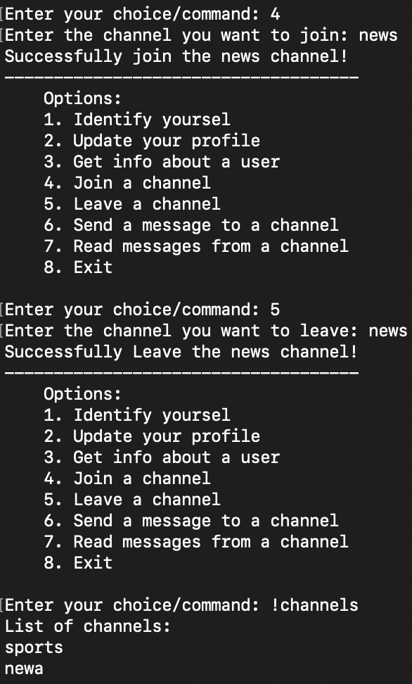

## Database management
I use HASH to store user information because we have multiple kinds of information for one user to record. I also used a set to store all the user names for fast look-up. 

## Monitoring with redis-cli
1. Ensure Redis server is running.
2. Open a terminal and run the following command
```
    docker-compose exec redis redis-cli
    MONITOR
 ```
>note: There are other available commands in redis-cli to play with, such as `KEYS *` and `DBSIZE`

## Functionalities
### user log in
a `username_set` is used to store all the user names for fast search, so when the user tries to log in, we just need to check if the name is in the set, which only takes O(1) time. Enter option 1 to log in. If the username is not in the username database, a new user will be created, and ask the user to input some information (see the user profile part). Below is the interaction in the user interface (left) and db (right).


### user inoformation
- Choose option 2 to update the user information or create a new user. If the username does not exist in the database, we will create a new one. <div></div>
user interface:

database:


- Once the user logged in, they can use the command `!whoami` to show their own profile.<div></div>


- Choose option 3 to get the other users' information. This uses `HGETALL` in our redis database to retrieve the values in hash. <div></div>
<div></div>
database:<div></div>


### channel operations
Users can subscribe or unsubscribe from a channel using options 4 and 5 respectively. Below is a demo of it and using `!channle` command to get a list of channels the user has subscribed to. <div></div>


database:<div></div>


### pubsub message in Redis

Enter option 6 or 7 to send or read message(s). I use the `pubsub.get_message()` with a timeout parameter to "listen" to the channel because the `pubsub.listen()` does not support a timing mechanism and I don't want the user to use interruption keys to stop listening. I set the wait time to be 1 minute, during which the listener can read every message sent in this channel. Below is a demo for a short conversation on a news channel. Below is a demo for a conversation on the news channel.<div></div>


database:<div></div>

